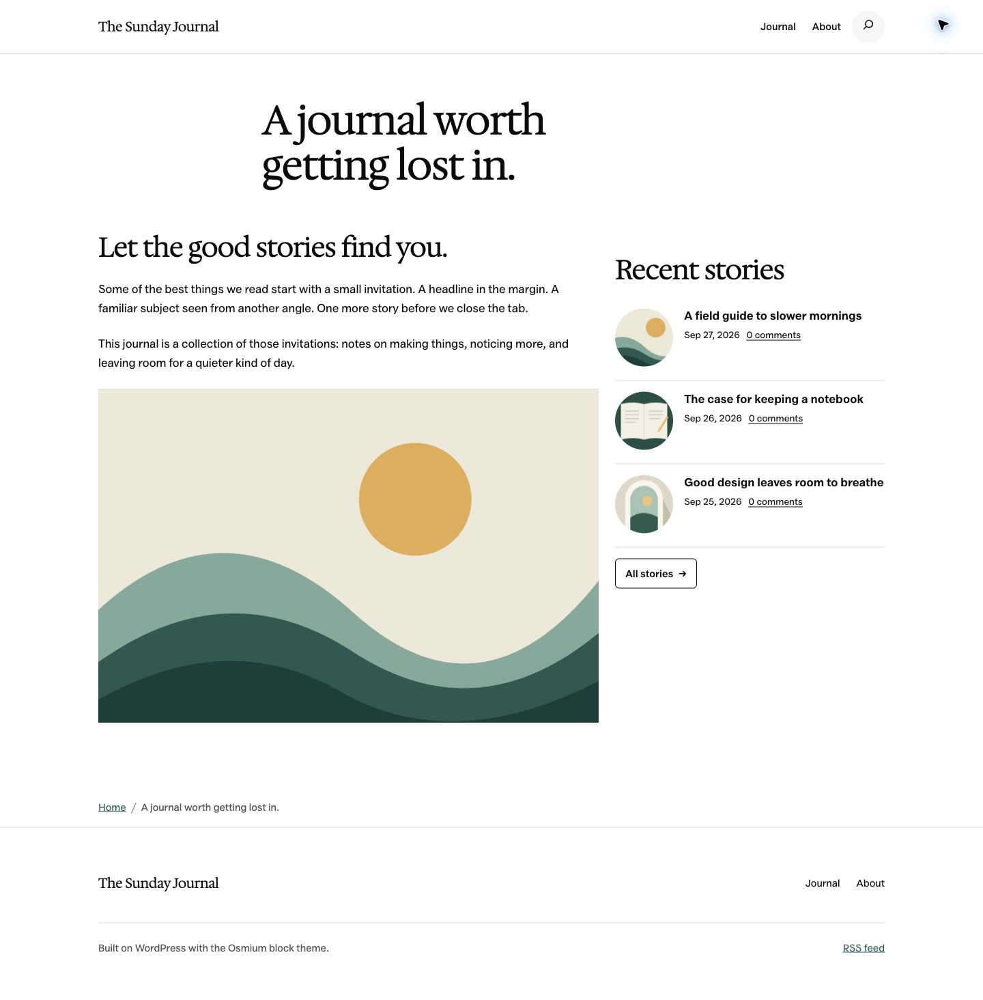

# Screenshot library

Captured 27 September 2026 from the local **The Sunday Journal** demo, using **Osmium 0.4.2**, **WordPress 7.1.2**, and **Beautiful Recent Posts 5.0.0-beta.1**. These are real browser captures of synthetic demo content. They can be reused for documentation, release preparation and comparison with later builds.

## Captures

| File | Shows |
| --- | --- |
| [Desktop](2026-09-27/osmium-desktop.jpg) | Full page: rounded list images, author/date/excerpt, no-image fallback, three-column cards and text-only shortcode |
| [Mobile](2026-09-27/osmium-mobile.jpg) | Actual 390px viewport, stacked cards and responsive list |
| [Cards](2026-09-27/osmium-cards.jpg) | Desktop three-card layout with original editorial illustrations |
| [Editor](2026-09-27/osmium-editor.jpg) | Native block selected, live preview and inspector controls |
| [Sidebar](2026-09-27/osmium-sidebar.jpg) | Legacy classic widget: circular thumbnails, comment links and the original page-link button |
| [Mobile sidebar](2026-09-27/osmium-sidebar-mobile.jpg) | Classic widget below the article column at 390px |
| [Dark and RTL](2026-09-27/osmium-dark-rtl.jpg) | Inherited dark colors and mirrored RTL flow; English sample content |

The [manifest](2026-09-27/manifest.json) records actual image dimensions and SHA-256 hashes. Keep dated capture folders instead of overwriting these when later versions change the design.

## Open the local scenes

- Main layouts: [Journal](http://localhost:8932/a-place-for-your-next-great-read/).
- Classic widget: [Sidebar](http://localhost:8932/?page_id=60).
- Dark/RTL: [Variants](http://localhost:8932/?page_id=62).
- Native controls: [Edit demo page](http://localhost:8932/wp-admin/post.php?post=18&action=edit).

Start **Beautiful Recent Posts QA** in Studio if the site is stopped. The source checkout is linked into that site, so later local code changes will change its output. Osmium was copied from the local release-check installation; its source repository was not modified.

Osmium is a block theme. The classic-widget screenshot uses [qa-widget-adapter.php](qa-widget-adapter.php), installed only in this QA site's `mu-plugins`. It calls the real `BRP_Widget` with the four legacy settings. The adapter and its hard-coded demo IDs are never shipped in the plugin ZIP. The dark/RTL adapter supplies the surrounding color and direction; the plugin inherits them.

## Reuse and artwork

`demo-assets/` contains the original editable SVG illustrations and PNG exports used in the sample posts. Created for this repository; licensed under its GPLv2-or-later license. The sample publication, author and article text are fictional. No user customer data appears in these screenshots.

The plugin's directory icons and banners are in the root `assets/` folder. They are separate from the screenshots and excluded from the runtime ZIP. Reusable screenshots have no browser chrome, capture labels or processing notes baked into the page.

## WordPress.org publication

All seven Osmium captures were uploaded through SVN revision `3715522` on 27 September 2026. Their directory filenames and readme caption order are: editor (`screenshot-1.jpg`), cards (`screenshot-2.jpg`), sidebar (`screenshot-3.jpg`), mobile (`screenshot-4.jpg`), desktop (`screenshot-5.jpg`), mobile sidebar (`screenshot-6.jpg`), and dark/RTL (`screenshot-7.jpg`). Copies live in the root `assets/` folder so future release workflows retain the gallery.

[Stable directory release capture](2026-09-27/wordpress-org-5.0.0.jpg) records the live branding immediately after the 5.0.0 publication, before the expanded readme/gallery update.

[Live gallery capture](2026-09-27/wordpress-org-gallery.jpg) records the published screenshot section after the SVN update; all seven image URLs were checked against the saved originals.
