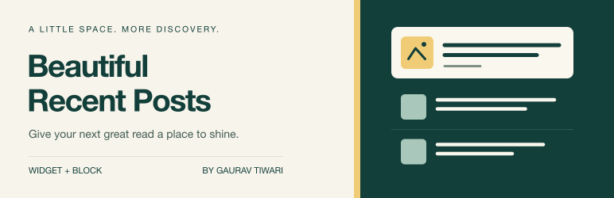

# Beautiful Recent Posts Widget



Give your next great read a place to shine. A lightweight WordPress plugin with a native block, a classic widget, and a shortcode.

**Version 5.0.0.** Requires WordPress 6.6+ and PHP 7.4+. Use a currently supported PHP version on production sites.

## What changed

- Teal editorial branding, editable vector sources, 128px/256px icons and standard/retina banners.
- Editorial lists and responsive cards; circular, rounded or square list thumbnails.
- Category selection, 1–20 posts, newest/modified/title ordering and optional current-post exclusion.
- Optional dates, authors, comment counts and plain-text excerpts.
- Native responsive images, semantic dates, keyboard focus styles and RTL layouts.
- Server-rendered output with no frontend JavaScript, tracking, remote services or external fonts.

The directory's original `BRPWidget.php` entry point is retained; activation of the GitHub-only 4.x filename migrates automatically. The original `BRP_Widget` class, `brp_widget` ID and four original settings are preserved. Existing widgets keep their default display choices. CSS has changed, so check theme overrides on staging. The translation domain now matches the plugin slug; custom `brpw` translations need to be migrated to `beautiful-recent-posts-widget`.

## Use it

Install the ZIP from `dist/` through **Plugins → Add New → Upload Plugin**. Add **Beautiful Recent Posts** in the block editor or Site Editor. Classic themes can use **Appearance → Widgets**.

```text
[beautiful_recent_posts totalnews="4" layout="cards" show_excerpt="true"]
[beautiful_recent_posts category="12" exclude_current="true" show_comments="false"]
```

Widget, block and shortcode share these settings:

| Setting | Default | Accepted values |
| --- | --- | --- |
| `title` | Empty | Plain text |
| `totalnews` | 3 | 1–20 |
| `category` | 0 | Category ID; 0 includes all; descendants included |
| `orderby` | `date` | `date`, `modified`, `title` (A–Z) |
| `layout` | `list` | `list`, `cards` |
| `image_shape` | `circle` | `circle`, `rounded`, `square`; list only |
| `show_image`, `show_date`, `show_comments` | true | `true` / `false` |
| `show_author`, `show_excerpt`, `exclude_current` | false | `true` / `false` |
| `excerpt_length` | 20 | 5–60 words, respecting WordPress locale behavior |
| `textbutton` | Empty | Button text |
| `pageid` | 0 | Published, non-password-protected page ID |

The publication date is displayed even when sorting by last modification. Quote and aside formats retain the legacy no-thumbnail behavior. Missing images require no placeholder. Excerpts omit dynamic blocks and shortcodes to avoid recursive rendering. Blocks in a Query Loop use the current loop post for exclusion.

The block lists the first 100 categories/pages alphabetically. **Advanced selection** accepts IDs beyond those results. Regenerate thumbnails if older uploads need the 85px and 170px square crops.

## Styling

The output inherits theme colors and type. Scope overrides under `.brpw`:

```css
.brpw {
  --brpw-gap: 1rem;
  --brpw-image-size: 85px;
  --brpw-accent: #123f3a;
}
```

Active classic widgets enqueue CSS before the head; WordPress handles block styles. Shortcodes or programmatic widgets rendered after the head print the registered stylesheet once on demand. There is no frontend script. Modern CSS uses grid, container queries, logical properties and `color-mix`; older browsers retain a basic readable layout.

## Development

No npm dependencies or build step are needed for the editor script. WordPress provides the editor packages and React. Development commands use Node 24+ and Python 3.

```sh
npm run check
wp eval-file /absolute/path/to/this/repo/tests/integration.php --path=/path/to/disposable-wordpress
python3 scripts/package.py
```

**Run the integration suite only on a disposable local site.** It creates temporary fixture posts and categories and removes them afterward. `tests/seed-demo.php` optionally creates persistent demo content on that site.

See [verification](docs/verification.md) for observed results and limitations, and the [Osmium screenshot library](docs/screenshots/README.md) for reusable desktop, mobile, editor and widget captures. CI is configured for PHP 7.4/8.2–8.5, WordPress latest plus minimum 6.6, and Node 24/26. The full configured matrix passed in the [release dry run](https://github.com/wpgaurav/Beautiful-Recent-Posts-Widget-for-WordPress/actions/runs/36320481308).

## Branding and packaging

Editable sources: `assets/icon.svg` and `assets/banner.svg`. Re-export with `sh scripts/brand-assets.sh` (requires librsvg). The banner uses system Helvetica Neue/Arial; no font files are bundled.

The plugin ZIP uses an explicit runtime allowlist. Tests, development scripts, screenshots and directory artwork are excluded. WordPress.org artwork belongs in the SVN repository's top-level `assets/` directory, separate from `trunk/`. Packaging does not deploy or publish anything.

## Release automation

Publishing a GitHub Release runs the quality matrix, attaches the verified ZIP and SHA-256, and deploys stable versions to WordPress.org with the new branding. Prereleases stay on GitHub. Manual workflow runs are dry runs; branch pushes never deploy. See [the release guide](docs/releasing.md).

## Support and license

Created by [Gaurav Tiwari](https://gauravtiwari.org/). Free software under [GPLv2 or later](LICENSE).

[Report an issue](https://github.com/wpgaurav/Beautiful-Recent-Posts-Widget-for-WordPress/issues) with your WordPress/PHP versions, theme and reproduction steps. [Buy me a coffee](https://buymeacoffee.com/gauravtiwari) to support maintenance.
